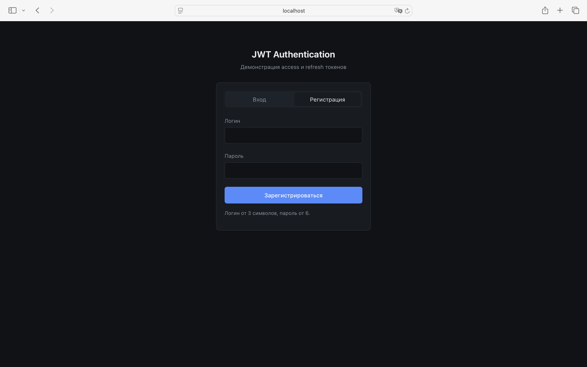
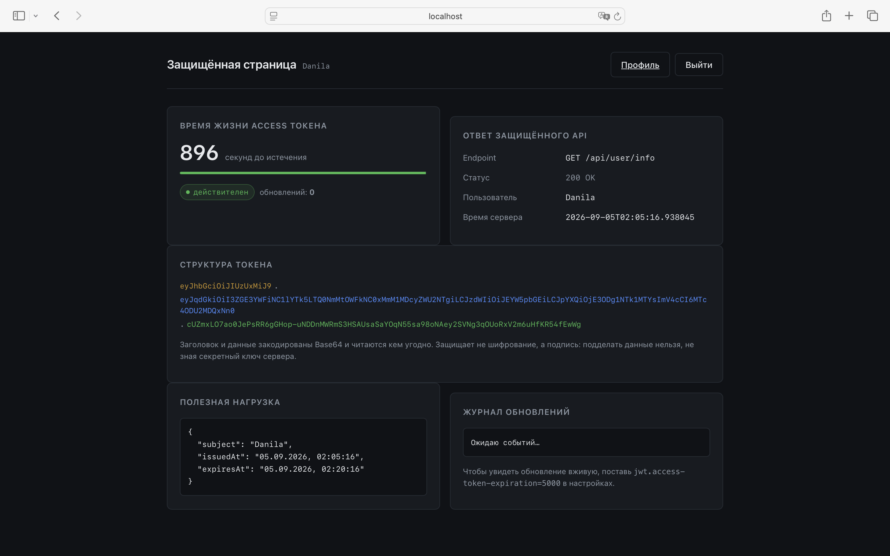
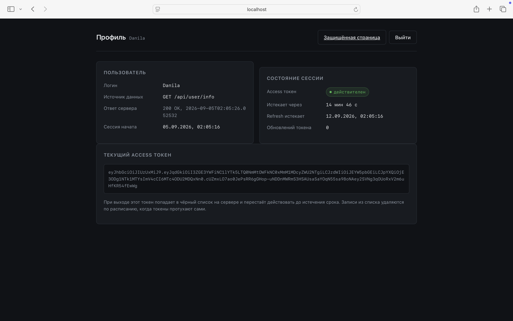

# Spring Boot JWT Authentication

Авторизация на JWT: пара access и refresh токенов, автообновление сессии и отзыв токена при выходе.


Учебный проект, чтобы разобраться с JWT на практике. Кроме API есть три страницы, где
видно, что происходит с токеном: сколько ему осталось жить, из чего он состоит и когда
обновился.

## Скриншоты







## Как работает

При входе выдаются два токена. **Access** живёт 15 минут и ходит в каждом запросе,
**refresh** живёт неделю и нужен только чтобы выпустить новый access. Короткий токен
светится в сети постоянно, длинный лежит на клиенте и используется редко.

Токен проверяется в `JwtAuthenticationFilter` — он стоит в цепочке Spring Security перед
обычной проверкой пароля. Сессий на сервере нет, режим `STATELESS`.

Когда до истечения access остаётся меньше 10 секунд, фронт сам дёргает `/api/auth/refresh`.
Пользователь ничего не замечает.

Сложность была с выходом: сервер не хранит состояние и не может «забыть» токен — тот
работает до конца срока. Поэтому при logout токен пишется в таблицу `blacklisted_tokens`.
Чтобы она не росла бесконечно, раз в час `BlacklistCleanupTask` вычищает всё, что уже
протухло само.

## API

| Метод | Путь | Что делает |
|---|---|---|
| POST | `/api/auth/register` | Регистрация |
| POST | `/api/auth/login` | Вход, выдаёт два токена |
| POST | `/api/auth/refresh` | Новый access по refresh |
| POST | `/api/auth/logout` | Отзыв токена |
| GET | `/api/user/info` | Данные пользователя, нужен токен |

Ошибки приходят единым форматом:

```json
{
  "status": 400,
  "message": "Проверьте введённые данные",
  "fields": { "password": "Пароль должен быть не короче 6 символов" }
}
```

```bash
curl http://localhost:8081/api/user/info -H "Authorization: Bearer <token>"
```

## Запуск

```bash
./gradlew bootRun
```

`http://localhost:8081`, тестовый пользователь `admin` / `admin`.
Консоль базы — `/h2-console`, строка `jdbc:h2:mem:testdb`, юзер `sa`, пароль пустой.

## Тесты

```bash
./gradlew test
```

Семь тестов на выпуск и проверку токенов — в том числе на то, что чужая подпись и мусор
вместо токена не проходят.

Один из тестов появился после бага: время выдачи в JWT хранится в секундах, поэтому два
токена одного юзера, выпущенные подряд, получались одинаковыми. Вышел и сразу зашёл —
получил токен, который уже в чёрном списке. Починил уникальным `jti` в каждом токене.

## Настройки

| Параметр | Значение |
|---|---|
| `jwt.access-token-expiration` | 900000 (15 мин) |
| `jwt.refresh-token-expiration` | 604800000 (7 дней) |
| `jwt.blacklist-cleanup-interval` | 3600000 (час) |

Секрет берётся из переменной окружения, в репозитории его нет:

```bash
export JWT_SECRET="ключ-минимум-32-символа"
```

Хочешь посмотреть автообновление вживую — поставь `jwt.access-token-expiration=5000`,
тогда токен истекает за 5 секунд и на защищённой странице видно, как он обновляется.

## Лицензия

[MIT](LICENSE)
